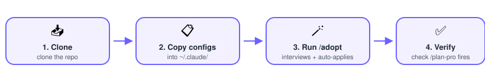

[English](README.md) | [ภาษาไทย](README.th.md) | [简体中文](README.zh-Hans.md) | [日本語](README.ja.md) | [Español](README.es.md) | **한국어** | [Português (Brasil)](README.pt-BR.md) | [Français](README.fr.md) | [Deutsch](README.de.md) | [Русский](README.ru.md)

<div align="center">


[](LICENSE)
[](#global-configskills)
[](#top)
[](#caveat-this-is-one-persons-setup)


</div>

한 사람이 사용하는 Claude Code 설정(지시문, 스킬, 훅, 지식 볼트)을 그대로 옮겨 담은 휴대용 스냅샷으로, 새로 시작하는 Claude Code 인스턴스가 동일한 작업 습관을 새 기기에서 그대로 부트스트랩할 수 있도록 묶어 놓았습니다. **그대로 실행하는 설정이 아니라 각자에 맞게 손봐서 쓰는 템플릿입니다.**

<details>
<summary>전체 설명 읽기</summary>

한 사람이 사용하는 Claude Code 설정을 그대로 옮겨 담은 스냅샷입니다. 전역 지시문, 엔지니어링 규칙, **엄선된 스킬 45개**(직접 작성한 7개 중 3개는 처음부터 새로 쓴 것, 4개는 서드파티 도구를 감싼 자체 래퍼, 나머지 1개는 업스트림 스킬을 각색한 것이며, 그 외는 업스트림 저장소에서 가져온 것으로 `sources.json`에 스킬별 출처가 전부 남아 있습니다), 실제 메모리 예시, 스킬 출처 매니페스트, 그리고 프로젝트를 넘나드는 지식 볼트까지 담겨 있습니다. 새로 시작하는 Claude Code 인스턴스(혹은 그것을 세팅하는 사람)가 동일한 작업 습관과 역량을 새 기기에서 그대로 부트스트랩할 수 있도록 묶어 놓았습니다. 이 저장소는 **그대로 실행하는 설정이 아니라 각자에 맞게 손봐서 쓰는 템플릿**입니다. 개인 식별 정보는 지우고 플레이스홀더로 바꿔 두었고, 일부 섹션은 그 안에서 언급하는 도구를 함께 도입해야만 의미가 있습니다.

</details>

## 시작하기 (퀵스타트)

> **지름길:** 저장소를 클론하고 Claude Code에서 열어 `/adopt`를 실행하세요 — 인터뷰 형식으로 물어보면서 아래 2, 3, 5, 7단계를 대신 처리해 주고, 재개 가능한 저널 파일에 진행 상황을 체크합니다. 6단계(플러그인 생태계 자체를 설치하는 것)는 의도적으로 `/adopt`의 범위 밖입니다 — 이건 직접 해야 합니다.

<p align="center"></p>

| # | 단계 | 위치 |
|---|---|---|
| 1 | 저장소를 클론 | 대상 기기의 편한 위치 아무 곳이나 |
| 2 | 결정: 로컬 Ollama 사전 압축을 원하나요? | [선택 사항: 로컬 AI](#선택-사항-로컬-aiollama-사전-압축) 참고 |
| 3 | 설정 파일을 `~/.claude/`로 복사 | `CLAUDE.md`, `agents/*.md`, `hooks/*.py`, `skills/*`, `tools/` — **"Installed Plugins"를 먼저 고쳐 쓰세요** |
| 4 | 설정 병합 | `global-config/settings.example.json` → `~/.claude/settings.json` (`<YOUR_HOME>` 교체) |
| 5 | 플레이스홀더 찾아 바꾸기 | 전체 목록은 [이 저장소 도입하기](#이-저장소-도입하기) 8단계에 있습니다 |
| 6 | 플러그인 생태계 설치 | [별도로 설치해야 할 것들](#별도로-설치해야-할-것들) 참고 |
| 7 | `notes/` + `memory-examples/` 복사 (선택) | 자신의 볼트 / auto-memory 폴더 |
| 8 | 확인 | 구현 계획을 요청해보기 — `/plan-pro`가 호출되나요? |

여러 AI 코딩 도구를 함께 쓰나요(Codex, Cursor, Gemini CLI 등)? `global-config/AGENTS.md`도 각 프로젝트 루트에 복사하세요 — [다른 AI 코딩 도구와의 호환성](#다른-ai-코딩-도구와의-호환성) 참고.

이 README의 나머지 부분에서는 각 구성 요소를 자세히 설명합니다.

## 이 안에 들어 있는 것

```
claude-clone-template/
├── README.md
├── LICENSE                                # MIT license for this repo's own content
├── ATTRIBUTION.md                         # Credits for the upstream repos the third-party skills were adopted from
├── .claude/commands/adopt.md              # Run `/adopt` in this repo to interview + auto-apply the steps below
├── global-config/
│   ├── CLAUDE.md                          # Global instruction file (~/.claude/CLAUDE.md equivalent)
│   ├── settings.example.json              # Sanitized ~/.claude/settings.json — hooks, plugins, model default
│   ├── agents/                            # 3 pinned-model subagent definitions (opus, haiku-batch, fable-medium)
│   ├── hooks/block-dangerous-git.py       # PreToolUse gate that asks before risky git commands
│   ├── rules/ecc-common/                  # 10 engineering-discipline rule files (ecc plugin ecosystem)
│   ├── skills/                            # 45 curated skill folders (the actual SKILL.md instructions, not just an index — see sources.json for provenance)
│   ├── SKILLS_INDEX.md                    # Personal index of installed skills/plugins + when to use which
│   ├── memory-examples/                   # 7 real auto-memory entries showing the memory system's format/patterns
│   ├── templates/                         # 2 starter templates to copy into a new repo (project-CLAUDE.md, conventions.md)
│   └── tools/
│       ├── skill-update-check/
│       │   ├── check.ps1                  # Weekly update checker — reads sources.json from this same folder
│       │   └── sources.json               # Real provenance manifest: 45 personal skills + 3 pip + 2 npm + 1 binary tool
│       └── ollama/ollama-digest.ps1       # On-demand local-model pre-digest helper (see the Ollama section below)
└── notes/                                 # 3 notes: a personal cross-project "second brain" vault (example content)
```

### `global-config/CLAUDE.md`
이 설정의 핵심입니다. 다음을 담고 있습니다.

- **비용을 고려한 모델 라우팅** — Sonnet을 메인 루프의 오케스트레이터로 두고, 작업 난이도에 따라 Haiku/Opus/Fable 서브에이전트에 위임하며, 누가 원본 파일을 읽고 누가 결론만 읽을지에 대한 확실한 규칙을 둡니다.
- **무거운 실행 작업 오프로딩** — 큰 작업을 별도 세션으로 넘겨서 현재 세션을 비대하게(그리고 비용을 많이) 만들지 않습니다.
- **계획 워크플로우** — 기본 플래너로 `/plan-pro`를 사용합니다.
- **세컨드 브레인 볼트 규칙** — "특정 저장소 하나에 종속되어 있는가?"라는 단일 기준으로 무엇이 볼트에 들어가고 무엇이 저장소의 docs/ADR에 들어갈지 결정합니다.
- **git 안전 훅** — 파괴적인 git 명령 전에 확인을 요구하는 PreToolUse 게이트입니다.
- **셸 관련 주의사항** — Bash 도구와 PowerShell 도구의 here-document 문법 차이 규칙(Windows 특유의 골칫거리로, 직접 겪으며 배운 내용입니다).
- **컨텍스트 자가 모니터링** — Claude가 언제 `/compact`를 먼저 제안해야 하는지에 대한 기준입니다.
- **AI 티 안 나게 쓰는 규칙** — 초안을 사람이 쓴 것처럼 읽히게 만드는 태국어·영어 종합 규칙(피해야 할 어휘, 구조적 패턴, 어투 맞추기)으로, 이 파일에서 가장 크고 범용성 있는 부분입니다. 뒷받침하는 세부 내용은 `memory-examples/`에 있습니다.
- **PR은 기본적으로 draft로 열기**, **크론/클라우드 에이전트 예약 전에는 먼저 물어보기**, **긴 명령을 실행하는 동안은 간결하게 설명하기**, 병렬 세션을 위한 **claude-in-chrome 공유 탭 그룹 주의사항**, Supabase를 쓰는 프로젝트라면 자동으로 실행하는 **Supabase RLS 점검**까지 포함합니다.

### `global-config/rules/ecc-common/`
ecc(everything-claude-code) 플러그인 생태계에서 가져온 일반적인 엔지니어링 규율입니다: TDD 워크플로우, 불변성, 커밋 형식, 보안 체크리스트, 코드 리뷰 심각도 단계, 에이전트 위임 규칙. ecc를 함께 사용할 때만 유용합니다(아래 "별도로 설치해야 할 것들" 참고).

### `global-config/skills/`
`SKILL.md` 폴더 45개(스킬에 따라 스크립트·참고 자료·데이터 파일이 딸려 있는 경우도 있습니다)로, 글쓰기/마케팅 실무(copywriting, copy-editing, hallmark, marketing-council, pricing 등), 엔지니어링 프로세스(debug-mantra, poka-yoke, second-brain, dependency-audit, secrets-audit 등), 디자인(design-system, ui-ux-pro-max, banner-design, mobbin-references 등), 그리고 Claude Code 자체를 관리하기 위한 메타 스킬(skillify, grilling, second-brain, graphify, plan-pro, shipping-a-branch 등)을 다룹니다. `poka-yoke`, `plan-pro`, `shipping-a-branch`는 처음부터 직접 작성했고, `graphify`, `dembrandt`, `markitdown`, `mobbin-references`는 SKILL.md는 직접 썼지만 내부적으로 쓰는 도구는 서드파티인 래퍼 스킬입니다(`ATTRIBUTION.md`에 출처를 명시하고 `sources.json`에 버전을 추적합니다). `deslop-defaults`는 각색한 것으로(`ibelick/ui-skills`에서 가져와 스택에 종속되지 않도록 다시 썼습니다), 나머지는 업스트림 저장소에서 그대로 가져온 것입니다 — 스킬별 출처는 `sources.json`을, 업스트림 크레딧은 `ATTRIBUTION.md`를 참고하세요. 이 스킬들은 단순히 설명만 적힌 문서가 아니라 실제로 재사용 가능한 프롬프트 엔지니어링 산출물입니다 — `~/.claude/skills/`에 복사하면 바로 동작합니다.

<details>
<summary><b>45개 스킬 전체를 카테고리별로 보기</b> (클릭해서 펼치기)</summary>

**엔지니어링 프로세스 & 워크플로우 (15)**

| 스킬 | 하는 일 |
|---|---|
| `debug-mantra` | 재현 → 추적 → 반증 → 교차 확인 순서로 진행하는 4단계 디버깅 규율로, 수정안을 제시하기 전에 반드시 암송합니다. |
| `poka-yoke` *(자체 작성)* | 문제가 생긴 뒤 잡아내는 대신, 애초에 잘못된 상태 자체가 불가능하거나 눈에 바로 띄게 만드는 실수 방지 리뷰입니다. |
| `post-mortem` | 버그가 수정되고 검증된 뒤 표준 형식의 근본 원인 보고서를 작성합니다. |
| `scrutinize` | 계획/PR/diff를 외부인의 시각으로 검토합니다 — 먼저 의도를 확인한 뒤 실제 코드 경로를 추적합니다. |
| `shipping-a-branch` *(자체 작성)* | 커밋 → 푸시 → PR → 리뷰 → 머지를 처음부터 끝까지 진행하며, 위험한 단계마다 따로 확인을 받습니다. |
| `plan-pro` *(자체 작성)* | 멀티 에이전트 리뷰 루프와 HTML before/after 출력이 포함된 구현 계획 작성기입니다. |
| `dependency-audit` | 프로젝트 의존성에서 알려진 CVE와 공급망 리스크를 점검합니다. |
| `secrets-audit` | 소스 코드, git 히스토리, 인프라에서 유출된 인증 정보와 취약한 비밀 관리 상태를 스캔합니다. |
| `prompt-injection` | 앱/에이전트에서 프롬프트 인젝션과 LLM 권한 경계 취약점을 점검합니다. |
| `decide` | 구조화된 의사결정 워크플로우(37signals 스타일의 질문 세트)로, 근거도 함께 보관합니다. |
| `unstuck` | "불가능하다"고 결론 내리는 대신 막힌 지점을 뚫을 수 있는 측면 사고 기법 모음입니다. |
| `teach` | 현재 작업 공간 안에서 사용자에게 새로운 개념/기술을 가르칩니다. |
| `wait-what` | 제대로 전달되지 않은 메시지를 표시하고 다시 설명합니다. |
| `skillify` | Claude Code 스킬을 대화, 영상, 덤프, 외부 저장소로부터 만들거나 각색하거나 업데이트합니다. |
| `wizard` | 사람만 수행할 수 있는 단계(자격 증명, 대시보드, 마이그레이션)를 위한 대화형 bash 마법사를 생성합니다. |

**디자인 & UI (11)**

| 스킬 | 하는 일 |
|---|---|
| `banner-design` | 다양한 아트 디렉션 스타일로 소셜/광고/웹/인쇄용 배너를 디자인합니다. |
| `design` | 로고, CIP 목업, 슬라이드, 배너, 아이콘, 소셜용 이미지를 아우르는 폭넓은 디자인 스킬입니다. |
| `design-system` | 원시(primitive) → 시맨틱 → 컴포넌트로 이어지는 3계층 디자인 토큰 구조와 슬라이드 생성을 제공합니다. |
| `deslop-defaults` *(각색)* | AI가 만든 UI가 밋밋하게 평준화되어 보이지 않도록 막는 구조적 기본값입니다(z-index, 강조색 절제, 상태 표현). |
| `hallmark` | 신규 페이지, 리디자인, URL/스크린샷에서의 디자인 추출을 위한 AI 슬롭 방지 디자인 스킬입니다. |
| `ui-styling` | shadcn/ui, Tailwind, 다크모드를 고려한 테마로 접근성 있는 UI를 만듭니다. |
| `ui-ux-pro-max` | 스타일, 팔레트, 폰트 조합, UX 가이드라인, 모션 프리셋, 차트 유형을 검색할 수 있는 UI/UX 데이터베이스입니다. |
| `mobbin-references` | UI를 디자인하기 전에 실제 앱의 레퍼런스 스크린샷(온보딩, 결제 화면, 빈 상태 등)을 가져옵니다. |
| `dembrandt` *(래퍼)* | DOM/CSS 검사를 통해 실제 웹사이트의 디자인 토큰(색상, 타이포그래피, 여백)을 추출합니다. |
| `image` | 마케팅용 이미지(히어로, 소셜 그래픽, 목업, OG 이미지)를 생성/편집/최적화합니다. |
| `slides` | Chart.js와 디자인 토큰 테마를 활용한 전략적 HTML 프레젠테이션을 만듭니다. |

**마케팅, 콘텐츠 & 브랜드 (13)**

| 스킬 | 하는 일 |
|---|---|
| `brand` | 브랜드 보이스, 비주얼 아이덴티티, 메시징 프레임워크, 일관성 점검을 다룹니다. |
| `community-marketing` | 커뮤니티 주도 성장 전략(디스코드/슬랙/포럼, 앰배서더 프로그램, 옹호 활동)을 세웁니다. |
| `content-strategy` | 어떤 콘텐츠를 만들지 결정합니다 — 토픽 클러스터, 에디토리얼 캘린더, 콘텐츠 축입니다. |
| `copy-editing` | 기존 마케팅 카피를 다듬고 손보고 리프레시합니다. |
| `copywriting` | 랜딩/가격/기능/소개 페이지용 새로운 마케팅 카피를 작성합니다. |
| `launch` | 제품 출시, 기능 발표, 고투마켓 체크리스트를 계획합니다. |
| `management-talk` | 엔지니어끼리 쓰던 글을 대상 채널(슬랙/이메일/스탠드업)에 맞춰 리더십용으로 다시 씁니다. |
| `marketing-council` | 포지셔닝 질문을 놓고 토론하는 가상의 마케터 자문단을 시뮬레이션합니다. |
| `marketing-ideas` | SaaS 및 소프트웨어 제품을 위한 성장/마케팅 아이디어를 생성합니다. |
| `marketing-psychology` | 행동과학 원리(앵커링, 사회적 증거, 프레이밍)를 마케팅 의사결정에 적용합니다. |
| `pricing` | 가격/패키징 전략과 가격 페이지 감사를 수행합니다. |
| `product-marketing` | 다른 마케팅 스킬들이 참조하는 재사용 가능한 제품/타겟/포지셔닝 컨텍스트 문서를 만듭니다. |
| `social` | 여러 플랫폼에 걸친 소셜 콘텐츠 제작, 스케줄링, 재가공, 소셜 리스닝을 다룹니다. |

**리서치 & 지식 관리 (6)**

| 스킬 | 하는 일 |
|---|---|
| `deep-research` | 인용, 상충되는 정보, 빈틈까지 담은 다중 출처·다단계 리서치 보고서를 작성합니다. |
| `graphify` *(래퍼, 자체 작성)* | 코드/문서/논문/이미지 등 어떤 입력이든 감사 보고서가 딸린 클러스터형 지식 그래프로 변환합니다. |
| `grilling` | 계획을 실제로 구축하기 전에 사용자를 집요하게 인터뷰해 압박 테스트합니다. |
| `second-brain` | Obsidian 스타일의 개인 지식 볼트를 위한 수집/정리/조회/린트/연결 워크플로우입니다. |
| `watch-video` | yt-dlp가 지원하는 모든 영상 소스에서 대본/시각/멀티모달 콘텐츠를 추출합니다. |
| `markitdown` *(래퍼)* | PDF/슬라이드/시트/오디오/HTML 등을 LLM/RAG용으로 깔끔한 마크다운으로 변환합니다. |

각 항목의 전체 출처(원본 저장소, 도입 날짜, 자체 작성/도입/각색 여부)는 `global-config/tools/skill-update-check/sources.json`에 있으며, 업스트림 크레딧은 `ATTRIBUTION.md`에 있습니다.

</details>

### `global-config/memory-examples/`
소유자의 실제 Claude Code 자동 메모리 시스템에서 가져온 항목 7개입니다(프로젝트별 사실이 아니라 이식 가능한 "일하는 방식" 습관입니다): 세션 간 메시징 관련 네이밍 규칙을 명확히 한 항목, 로컬 Ollama를 사전 압축으로 쓰는 패턴, "스킬 노트 갱신"이 실제로 무엇을 의미하는지에 대한 규칙, 셸 이스케이프 관련 주의사항(`\b`가 조용히 백스페이스 바이트로 바뀌는 문제), 컨텍스트 비대화를 얼마나 공격적으로 줄여야 하는지에 대한 피드백 항목, 그리고 CLAUDE.md의 AI 티 안 나게 쓰는 규칙을 뒷받침하는 전체 세부 내용(어휘 표 + before/after 예시)을 태국어와 영어 두 언어로 담은 항목입니다. 이 항목들은 특정 내용 자체보다는 좋은 메모리 항목이 어떤 *형태*(규칙 + 이유 + 적용 방법)를 갖는지를 보여주기 위해 존재합니다 — 메모리가 전체 워크플로우에서 어떻게 맞물리는지는 `global-config/rules/ecc-common/`을, 이 소유자가 사용하는 로컬 대 글로벌 메모리 구분은 CLAUDE.md의 "จำ/บัญญัติ" 섹션을 참고하세요.

### `global-config/tools/skill-update-check/sources.json`
소유자의 실제 스킬/도구 도입 매니페스트입니다 — 45개의 개인 스킬(자체 작성 및 각색한 것 포함)과 pip 패키지 3개, npm 패키지 2개, 바이너리 도구 1개에 대한 실제 출처 데이터(원본 저장소 URL, 설치 메모, 버전 이력)를 담고 있습니다. `check.ps1`과 짝을 이루어, `claude-clone-template`을 도입한 사람이 `~/.claude/skills/`로 복사해 온 스킬들의 업스트림 업데이트를 원래 소유자와 똑같은 방식으로 추적할 수 있게 해 줍니다. `last_seen_commit` 값은 받는 사람 입장에서는 대부분 `unknown`이거나 오래된 상태이며, `check.ps1 -Ack`를 한 번 실행해서 자신만의 기준점을 세우기 전까지는 그렇습니다.

### `global-config/templates/`
새 저장소에 처음 세팅할 때 복사해 넣는 작은 시작 파일 2개입니다(`project-CLAUDE.md`, `conventions.md`) — 45줄 이하의 "라우터" 역할을 하는 프로젝트 CLAUDE.md와 conventions/green-gate 템플릿입니다. 각 파일에는 부트스트랩하려는 스택에 맞춰 채워 넣는 PRESET 주석 블록이 있습니다(현재는 Python 웹 예시 하나뿐입니다). 자신의 스택에 필요하다면 같은 방식으로 프리셋을 추가하면 됩니다.

### `notes/`
소유자의 Obsidian 세컨드 브레인 볼트에서 가져온 예시 콘텐츠입니다: 로컬 Ollama 모델 인벤토리, 즐겨찾는 저장소 목록, 기타 참고 메모들입니다. 이는 프로젝트를 넘나드는 볼트에 *어떤 종류의 것*이 들어가는지 보여주기 위한 것이지, 누구에게나 반드시 필요한 것은 아닙니다. 구조 아이디어만 가져가고 내용은 시간이 지나면서 자신의 것으로 바꿔 나가세요.

## 이 저장소 도입하기

1. **`global-config/CLAUDE.md`를 복사**해서 자신의 `~/.claude/CLAUDE.md`로 넣으세요. 기존 내용과 병합하거나 아예 대체해도 됩니다 — 판단은 각자의 몫입니다. 먼저 읽어보고 자신에게 맞지 않는 섹션은 지우세요. **다른 무엇보다 먼저 "Installed Plugins" 섹션을 다시 써야 합니다** — 현재는 특정 플러그인(superpowers, ecc, pordee, lazyweb, andrej-karpathy-skills)이 설치되고 활성화되어 있다고 단언하며, Claude에게 설치를 언급하지 말라고까지 지시합니다. 이는 원래 소유자에게만 해당하는 내용이지 여러분에게는 아닙니다. 실제로 설치한 플러그인 목록으로 바꾸거나, 뭔가 설치하기 전까지는 지워 두세요.
2. **`global-config/agents/*.md`를 `~/.claude/agents/`로, `global-config/hooks/block-dangerous-git.py`를 `~/.claude/hooks/`로 복사**하세요. 이 파일들이 있어야 CLAUDE.md의 모델 라우팅 규칙과 git 안전장치가 단순한 텍스트가 아니라 실제로 동작합니다.
3. **`global-config/skills/*`를 `~/.claude/skills/`로 복사**하세요. 이 부분이 실질적인 가치의 대부분을 차지합니다 — 45개의 실제로 동작하는 스킬 폴더이지, 단순히 설명만 있는 게 아닙니다.
4. **`global-config/settings.example.json`을 자신의 `~/.claude/settings.json`에 병합**하세요(먼저 `<YOUR_HOME>`을 실제 홈 경로로 바꾸세요). 이미 settings.json이 있다면 덮어쓰지 말고 병합하세요 — `hooks.PreToolUse` 항목과 `enabledPlugins`에서 원하는 부분을 가져오면 됩니다. 배포된 훅 명령은 Windows의 `py` 런처를 사용합니다. macOS/Linux에서는 먼저 `python3`로 바꾸세요.
5. ecc 플러그인을 설치할 **경우에만** **`global-config/rules/ecc-common/`을 `~/.claude/rules/`로 복사**하세요. 그렇지 않다면 건너뛰세요.
6. **`global-config/memory-examples/*.md`를 적용하고 싶은 프로젝트의 자동 메모리 폴더로 복사**하세요(Claude Code 자동 메모리는 프로젝트별로 `~/.claude/projects/<project>/memory/`에 저장됩니다). 혹은 참고 자료로만 읽고 자신만의 내용을 처음부터 작성해도 됩니다.
7. **`notes/`를 자신의 세컨드 브레인 볼트 위치로 복사**하세요(Obsidian이나 일반 마크다운 도구가 볼 수 있는 아무 폴더나 상관없습니다). 볼트를 원하지 않는다면 완전히 건너뛰어도 됩니다.
8. **모든 플레이스홀더를 찾아 바꾸세요** — 가장 중요한 단계입니다.
   - `<YOUR_USERNAME>`, `<YOUR_HOME>` → 실제 Windows/시스템 사용자명과 홈 경로
   - `<YOUR_VAULT_PATH>` → 세컨드 브레인 볼트를 두는(또는 둘 예정인) 위치
9. **`global-config/tools/`**(`skill-update-check/`와, Ollama를 유지한다면 `ollama/`도 함께)를 `~/.claude/tools/`로 복사한 뒤, **`sources.json`에 자신만의 기준점을 설정**하세요: 스킬을 복사한 뒤 `check.ps1 -Ack`를 한 번 실행하면, `last_seen_commit`이 원래 소유자의 이력이 아니라 자신이 통제하는 시작점을 반영하게 됩니다.

## 별도로 설치해야 할 것들

이 저장소에는 스킬 생태계 자체가 아니라 **그것들에 대한 참조와 규칙**만 담겨 있습니다. CLAUDE.md의 지시문이 의미를 가지려면 다음을 설치해야 합니다.

- **superpowers** (obra/superpowers) — brainstorming, writing-plans, TDD, 디버깅 스킬
- **ecc / everything-claude-code** (affaan-m/ECC) — 에이전트, 스킬, 커맨드, MCP 서버
- `SKILLS_INDEX.md`에 언급된 그 외 플러그인 중 원하는 것

새 기기에서 Claude Code의 플러그인 시스템을 통해 설치한 뒤, 실제로 설치한 내용에 맞춰 `SKILLS_INDEX.md`를 정리하세요.

---

## 구독 플랜과 Fable 5.1 등급에 대한 참고 사항

CLAUDE.md의 모델 라우팅 사다리는 `fable-medium` 서브에이전트에서 최고 등급에 도달하는데, 이 모델은 **Max** 플랜이 있어야 합니다 — **Pro** 플랜에서는 스폰하는 순간 그냥 실패합니다. `/adopt`가 인터뷰 과정에서 이 질문을 하고 대신 고쳐 줍니다.

<details>
<summary>Max 플랜이 아니라면 수동으로 고치는 법</summary>

`CLAUDE.md`의 모델 라우팅 사다리는 `fable-medium` 서브에이전트에서 최고 등급에 도달합니다 — 가장 어려운 문제를 위한, 의도적으로 비싸고 좀처럼 쓰지 않는 에스컬레이션 등급입니다. 원래 소유자는 해당 모델을 쓸 수 있는 **Max** 플랜을 사용합니다. **Pro** 플랜(또는 Fable 5.1에 접근할 수 없는 플랜)을 쓴다면 `fable-medium`을 호출하는 순간 그냥 실패합니다.

`CLAUDE.md`를 그대로 복사하기 전에 어떤 플랜을 쓰고 있는지 확인하세요. Fable 5.1이 없다면:
- 모델 라우팅 섹션에서 `fable-medium` 관련 단락과 "สุดบันได"(사다리 최상단) 항목을 지우세요.
- 사다리의 최상단을 `opus`에서 멈추도록 바꾸세요 — 어렵고 위험 부담이 큰 작업을 Opus로 에스컬레이션한다는 라우팅 로직 자체는 그대로 유지되며, 다만 그 위로 올라갈 등급이 없을 뿐입니다.
- `~/.claude/agents/`로 복사할 목록에서 `global-config/agents/fable-medium.md`를 빼세요.

`/adopt`는 인터뷰 과정에서 이 질문을 하고 대신 수정해 줍니다. 파일을 직접 손으로 복사하는 경우라면, Claude가 플랜에서 접근할 수 없는 서브에이전트를 계속 호출하려 들지 않도록 직접 처리해 두세요.

</details>

---

## 선택 사항: 로컬 AI(Ollama) 사전 압축

무료지만 손실이 있는 사전 압축 등급입니다 — 로컬 모델이 길고 중요도 낮은 텍스트를 유료 모델의 컨텍스트에 들어가기 전에 먼저 소화합니다. 역량은 전혀 추가되지 않고 순전히 비용만 절감합니다. 건너뛰어도 되며, 이 저장소의 다른 어떤 부분도 여기에 의존하지 않습니다.

<details>
<summary>자세히 보기 — 이걸 원하시나요</summary>

원래 설정은 로컬 Ollama 모델을 **무료이자 손실이 있는 사전 압축 등급**으로 사용합니다 — 길고 중요도가 낮은 텍스트(로그, 장황한 문서)를 유료 모델의 컨텍스트에 들어가기 *전에* 로컬 모델에 통과시켜 요약합니다. 이는 비용 사다리에서 **Haiku보다 아래**에 위치하며 라우팅 등급이 아닙니다. 도구 접근도, 저장소 컨텍스트도 없이 텍스트 입력과 출력만 있습니다. 비용은 절감하지만 어떤 역량도 더해 주지 않습니다. 이 저장소의 다른 어떤 부분도 이것에 의존하지 않습니다.

**그러니 스스로 답해야 할 질문 하나: 이걸 위해 로컬 Ollama 모델을 세팅하고 싶은가요?**

### 아니오라면
이 섹션 전체를 건너뛰세요. 자신의 `CLAUDE.md` 사본에서 Ollama 관련 단락을 지우고 `notes/local-ollama-models.md`도 빼세요. 나머지는 이것 없이도 잘 동작합니다.

### 예라면
1. [ollama.com](https://ollama.com)에서 **Ollama를 설치**하세요.
2. **모델 저장 위치를 정하세요.** 모델은 용량이 큽니다(27B 모델이면 수십 GB입니다). 기본 위치는 시스템 드라이브입니다(Windows에서는 `%USERPROFILE%\.ollama`). 시스템 드라이브 용량이 빠듯하다면 더 큰 드라이브로 저장 위치를 옮기세요 — 원래 설정은 바로 이 이유로 `D:\ollama`를 사용했습니다. Windows에서는 모델을 받기 전에 `OLLAMA_MODELS` 환경 변수를 원하는 경로로 설정하세요. 다른 플랫폼에는 그에 상응하는 환경 변수나 심볼릭 링크 방식이 있습니다.
3. **범용 지시-튜닝 모델을 최소 하나 받으세요**(예: `ollama pull qwen2.5:7b-instruct` 혹은 비슷한 7~9B 규모의 지시-튜닝 모델 — 빠르게 돌 만큼 작으면서도 요약하기에 충분한 성능입니다). `notes/local-ollama-models.md`에 있는 원래 인벤토리는 한 가지 구성 예시를 보여줍니다: 최고 품질을 위한 27B 대형 모델 하나, 속도/추론/코드용 7~9B 중형 모델들, 비전 지원 모델(`llava:7b`) 하나 — 이 목록은 그대로 따라야 할 쇼핑 리스트가 아니라 참고용으로 보면 됩니다.
4. **사용 패턴을 익히세요:** 파일을 파이프로 넣으면 요약본이 나옵니다 —
   ```powershell
   Get-Content <file> | ollama run <model> "<instruction>"
   ```
   (파일을 파이프로 넣으세요. 긴 프롬프트를 인자로 밀어 넣지 마세요.)
5. **하나의 확고한 규칙을 기억하세요:** 로컬 모델의 출력은 **절대 그라운드 트루스가 아닙니다**. 중요도가 낮은 텍스트에 대한 손실 압축일 뿐입니다. 어떤 결정이 그 내용에 달려 있다면, 유료 모델이 원본을 읽어야 합니다 — 예외는 없습니다.

이 기능은 100% 선택 사항이며 건너뛰어도 무방합니다. 순전히 대량 텍스트의 토큰 비용을 줄이기 위해 존재합니다.

</details>

---

## 다른 AI 코딩 도구와의 호환성

파일이 하나 대신 두 개 제공됩니다: CLAUDE.md(Claude Code 전용)와 AGENTS.md(이식 가능한 부분 — [agents.md](https://agents.md), Codex, Cursor, Gemini CLI, Copilot도 읽습니다).

<details>
<summary>두 파일이 어떻게 상호작용하는지</summary>

이 템플릿은 오직 **Claude Code**를 위해 만들어졌습니다. 여기서 의존하는 메커니즘들 — 자동으로 로드되는 `CLAUDE.md`, `Skill` 도구, `settings.json` 훅, 서브에이전트 정의 — 은 이식 가능한 파일 포맷이 아니라 Claude Code 고유의 기능입니다. Codex CLI, ChatGPT, Antigravity, Cursor 등 다른 도구를 이 저장소에 향하게 한다고 해서 스킬이나 규칙을 자동으로 "인식"하지는 않습니다. Claude Code 밖에서는 여기 있는 어떤 것도 바로 동작하지 않습니다.

수작업으로 적용할 수 있는 부분:
- `global-config/CLAUDE.md`는 그냥 텍스트입니다 — 원하는 부분을 골라 `AGENTS.md`(Codex CLI 등 일부 도구가 읽는 파일)나 커스텀 시스템 프롬프트에 붙여 넣으세요. Claude Code 고유 메커니즘(spawn_task, Skill 도구, 서브에이전트 라우팅)을 언급하는 부분은 먼저 빼세요 — 다른 곳에서는 아무 의미가 없습니다.
- `global-config/skills/<name>/SKILL.md` 아래의 각 스킬은 그냥 마크다운 지시문 파일입니다. 다른 도구의 커스텀 지시문에 붙여 넣을 수는 있지만, 자동 트리거링은 사라지고, 딸려 있는 스크립트는 그 도구가 실제로 실행할 수 있는 셸을 가정하고 있습니다.
- 훅(`settings.json`)과 서브에이전트 파일(`agents/*.md`)은 Claude Code 전용입니다 — 이식할 대상이 따로 없습니다.

Codex/ChatGPT/Antigravity를 평소에 쓴다면, 이 저장소는 여전히 *참고 자료*로 쓸모가 있습니다(글쓰기 규칙, .docx 수정, git 안전 훅 로직 등). 다만 폴더를 그대로 가져다 놓고 동작하기를 기대하기보다는 필요한 부분을 복사/붙여넣기 하는 방식이 될 것입니다.

</details>

---

## 주의: 한 사람의 설정입니다

이 스냅샷은 특정한 워크플로우에서 나온 것입니다: 태국어와 영어를 함께 쓰는 사용자가 Windows 기기에서 쓰던 설정입니다. CLAUDE.md 곳곳에 있는 이중언어 섹션, PowerShell과 Bash 사이의 사소한 차이들이 그걸 보여줍니다.

쓸모 있는 부분은 가져가고 아닌 부분은 버리세요. 이 중 어느 것도 정해진 모범 사례가 아닙니다 — 한 사람에게 통했던 방식을 이식 가능할 정도로 잘 정리해 둔 것뿐입니다. 진짜 가치는 개별 규칙 하나하나가 아니라 이 시스템의 *형태*(비용에 따른 라우팅, 무거운 작업 오프로딩, 지식 한 조각당 하나의 저장 위치, 파괴적 명령에 대한 안전장치)에 있습니다.
