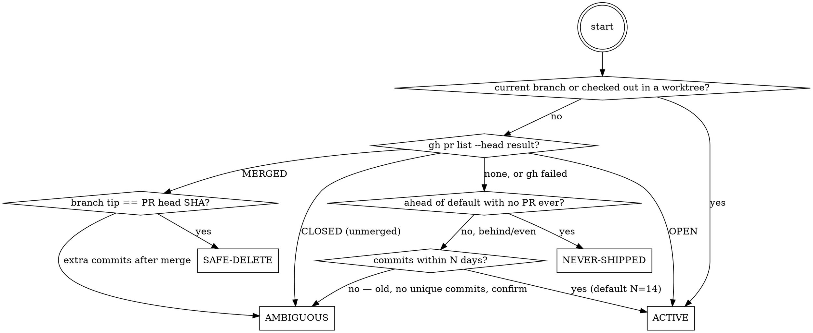

# Pruning Branches

## Overview

Periodic repo housekeeping: sync the default branch with remote, survey every local branch, classify each, then let the user pick what to delete. Distinct from `shipping-a-branch` (which handles one feature's ship flow) — this is "clean up the whole repo's branch clutter."

**Core principle:** `git branch --merged`/`--no-merged` lies whenever a PR was squash-merged (GitHub squash creates a new commit hash, so the original commits are never literal ancestors of main). **PR state via `gh`, not git ancestry, is the source of truth for "is this actually merged."**

## Workflow

### 1. Sync the default branch

Detect it — don't assume "main" or "master": `gh repo view --json defaultBranchRef -q .defaultBranchRef.name`, or fall back to `git symbolic-ref refs/remotes/origin/HEAD`.

`git fetch --prune`, then fast-forward only (`git pull --ff-only`, or `git fetch origin <default>:<default>` if not currently checked out there). Fast-forward fails (local diverged from remote) → report the divergence, stop, ask — don't force.

### 2. Enumerate

`git branch --format=...` (local; add `-r` for remote if the user wants remote cleanup too), `git worktree list --porcelain`, `git status --porcelain` per relevant path, and the current branch.

### 3. Classify every branch

Run the classification below. **The `gh pr list --head <branch> --state all --json state,number,title,mergedAt` check is mandatory before any "merged" verdict** — never skip it because git ancestry already says merged.

**Categories:**

| Category | Meaning | Action |
|---|---|---|
| `ACTIVE` | Current branch, checked out in a worktree, has an open PR, or recent commits | Leave alone |
| `SAFE-DELETE` | PR shows MERGED and branch tip == PR head SHA (no post-merge commits) | Offer for deletion |
| `NEVER-SHIPPED` | Ahead of default branch, zero PRs ever opened for it | **Never delete by default** — surface prominently, may be lost work |
| `AMBIGUOUS` | Closed-unmerged PR, merged PR with extra commits after merge, `gh` unavailable/non-GitHub remote, or old-with-no-unique-commits | Needs human judgment — never auto-delete |

`gh` errors or the remote isn't GitHub → degrade that branch to `AMBIGUOUS`. Never fall back to trusting git ancestry alone.

### 4. Present a triaged report

One table per category: branch name, last commit date/author, ahead/behind counts vs. default, PR number + state (if any), worktree location (if checked out elsewhere).

### 5. Confirm deletions ⛔

Show the full `SAFE-DELETE` list with per-branch evidence (PR #, merge date, tip SHA) and let the user pick all / a subset / none. **Fresh confirmation per batch — a broad earlier "clean this up" does not pre-authorize the actual deletions; confirm the itemized list now.**

Escalate to a louder, separate confirmation for:
- Remote branch deletions
- Anything in `AMBIGUOUS` (only if the user explicitly asks to consider it)
- Any branch checked out in another worktree — require the user to acknowledge worktree removal first (`git worktree remove` before `git branch -d`)

`git branch -d` refuses (unmerged per git) → that's a signal to re-classify as `AMBIGUOUS`, not to escalate to `-D`.

`NEVER-SHIPPED` branches are never offered for deletion by default — only delete one if the user explicitly names it after seeing the report.

### 6. Re-surface genuinely unshipped work

For `NEVER-SHIPPED` (and any `AMBIGUOUS` branch the user confirms is real work), offer instead of deletion: open a PR for it now — hand off to `shipping-a-branch` — or just leave it and move on. Deleting real unshipped work is the failure mode this whole skill exists to prevent.

## Red Flags — Do Not Rationalize Past These

| Excuse | Reality |
|---|---|
| "git says unmerged, so it's unshipped" | Squash-merge breaks ancestry. Check `gh pr list` before concluding anything is missing. |
| "git says merged, skip the PR check" | Still show the PR evidence in the report — ancestry alone isn't proof for the user either. |
| "Branch is 6 months old, must be dead" | Age isn't deadness. Old + never-PR'd is exactly the case most likely to be forgotten real work. |
| "User said clean up, so batch-delete without showing the list" | Every batch needs a fresh, itemized confirmation — see Instruction Priority: permission is per-action. |
| "`-d` refused, use `-D` to force it" | A `-d` refusal is a signal to re-classify as AMBIGUOUS, not an obstacle to force past. |
| "It's probably fine to delete a worktree branch" | Never, without the user acknowledging worktree removal first. |
| "`gh` errored, fall back to ancestry-only" | Degrade to AMBIGUOUS instead — don't silently trust the weaker signal. |

## Common Mistakes

- Trusting `git branch --merged` as the deletion criterion on a repo that uses squash-merge (most GitHub repos with "Squash and merge" enabled).
- Auto-including `NEVER-SHIPPED` branches in a deletion batch because they're old.
- Deleting a branch that's checked out in another worktree without removing the worktree first (leaves a broken worktree pointing at a dead branch).
- Force-pulling or force-pushing to "fix" a diverged default branch instead of stopping and asking.

## Note (poka-yoke)

The classification rules here are themselves a fixed-value guard (SAFE-DELETE requires *all* conditions, not a best guess). Don't add new "shortcuts/exceptions" to the classification in a future edit without checking it doesn't reopen a side-door this skill was built to close.
