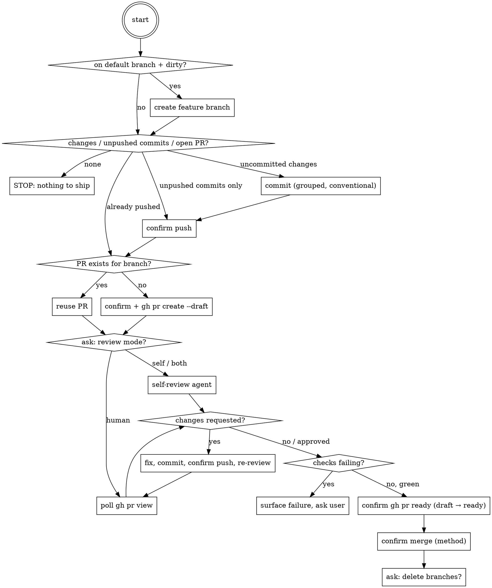

# Shipping a Branch

## Overview

End-to-end git workflow: commit → push → open draft PR (or reuse existing) → review → mark ready → merge → cleanup. Orchestrates existing skills/tools rather than reimplementing them. Every high-blast-radius action (push, PR create, mark ready, merge, branch delete) gets a **fresh, per-action confirmation** — no matter what the user said earlier in the conversation.

**Core principle:** Invoking this skill IS the user's ask to commit. It is NOT pre-authorization for push, PR, merge, or cleanup — each of those is confirmed separately, every time.

**Exception — Auto Mode direct invocation (บัญญัติ 2026-08-31, user-requested):** the paragraph above is the DEFAULT. It flips only when BOTH hold:

1. The current session is running in **Auto Mode** permission, AND
2. The user **directly and explicitly** invoked this skill themselves this turn — typed `/ship` or `/shipping-a-branch`, or said something unambiguous like "ship this" / "commit and open a PR" / "get this merged" in their own message.

Under those two conditions together, the invocation IS blanket authorization through Phase 6: every `⛔ CONFIRM` checkpoint below (Phase 2 push, Phase 3 PR create, Phase 5 mark ready, Phase 6 merge) is **skipped** — act, don't ask, then report what was done afterward. This does NOT relax anything else:

- Still never force-push over a rejected push (fetch/rebase or stop and report — a rejection is a merge conflict risk, not a permission gate).
- Still stop and report (don't push through) on red CI checks, missing/failed review, or any other correctness signal — those are "something may be broken" branches, not authorization gates, and Auto Mode does not make a red check green.
- Still never fabricate/assume a human review approval, and never `gh pr review --approve` your own PR.
- Branch deletion is never auto-executed — default is leave-as-is (matching the global post-merge-cleanup default); just report that the branch was left in place, don't ask and don't delete.
- If EITHER condition is false — not Auto Mode, or the skill was reached indirectly (another skill/agent chained into it, or the user's ask was vague enough to need interpretation) — fall back to the default behavior: every checkpoint below asks, every time.

## When to Use

- User says "ship this", "commit and open a PR", "get this merged", or runs `/ship`
- NOT for commit-only ("just commit this") — do that directly, skip this skill
- NOT for review-only on an existing PR — use `ecc:review-pr` or `superpowers:requesting-code-review` directly
- NOT for opening a PR on an already-pushed branch with no new changes — skip to Phase 3

## Workflow

### Phase 0 — Preconditions

Run `git status`, `git branch --show-current`, `gh repo view --json defaultBranchRef`, `gh pr list --head <branch>`.

- On the default branch with dirty changes → create a feature branch first (name it from the change summary) before committing.
- No uncommitted changes, no unpushed commits, and no open PR → nothing to ship. Report and stop.
- No uncommitted changes but unpushed commits or an open PR exist → skip straight to the relevant phase (don't re-commit or re-create).

### Phase 1 — Commit

Group changes logically, write conventional-commit messages (`feat:`, `fix:`, `refactor:`, etc.), no `Co-Authored-By` or "Generated with Claude Code" trailers. The user invoking this skill is the explicit commit authorization — no extra confirmation needed for the commit itself.

### Phase 2 — Push ⛔ CONFIRM (skipped under the Auto Mode direct-invocation exception — see Overview)

Surface: branch name, remote, commit count + subject lines, whether this is a new branch or an update to an existing one. Wait for explicit yes before pushing. Push rejected (non-fast-forward)? Fetch/rebase or ask the user — **never force-push to "fix" a rejection**.

### Phase 3 — PR create-or-reuse

`gh pr list --head <branch>` first, always — never create a duplicate PR.

- Open PR already exists → reuse it (the push in Phase 2 already updated it). No confirmation needed to "reuse."
- No PR exists → ⛔ CONFIRM (skipped under the Auto Mode direct-invocation exception — see Overview): surface title, base←head, and a 2-3 line summary. Then `gh pr create --draft` — **draft by default** (per the global draft-first rule); omit `--draft` only if the user explicitly asked for ready-for-review. If the repo rejects `--draft` (draft PRs unsupported on some plans), surface that and ask before creating a ready PR.

### Phase 4 — Review

Ask the user: human review, self-review, or both?

- **Self-review**: delegate to `superpowers:requesting-code-review` (or `ecc:code-review`); process findings via `superpowers:receiving-code-review`.
- **Human review**: poll `gh pr view --json reviews,reviewDecision,statusCheckRollup`. If pending, offer to stop here and resume later — **never fabricate or assume approval**, and never call `gh pr review --approve` on your own PR.
- **Posting a review on the PR**: never auto-submit via `gh pr review` with an event. Create a **pending review** instead (`gh api repos/{owner}/{repo}/pulls/{pr}/reviews` with no `event` field), then tell the user it's waiting in the GitHub UI for them to edit/submit.
- Changes requested → fix, commit, re-confirm push (Phase 2 rules apply again), loop back to review check.

### Phase 5 — Mark ready-for-review ⛔ CONFIRM (skipped under the Auto Mode direct-invocation exception — see Overview)

Draft PRs cannot be merged. If the PR is still a draft (`gh pr view --json isDraft`), confirm with the user, then `gh pr ready <pr>`. This is its own checkpoint — marking ready publishes the PR to reviewers, so never bundle it silently into the merge step. Skip if the PR is already ready.

### Phase 6 — Merge ⛔ CONFIRM (skipped under the Auto Mode direct-invocation exception — see Overview)

Only proceed once checks are green AND the chosen review mode is satisfied. Checks red? Surface the failure and ask the user — do not merge over red checks by assuming "unrelated flake." This check is NOT skipped by the Auto Mode exception (see Overview) — it's a correctness gate, not an authorization gate.

Confirm: PR number, title, merge method (squash/merge/rebase — ask, or read the repo's allowed methods via `gh repo view`). For the underlying merge-vs-close-vs-keep-open decision framing, defer to `superpowers:finishing-a-development-branch`.

### Phase 6.5 — Update the global worklog index

After a successful merge, grep `<YOUR_VAULT_PATH>\worklog\INDEX.md` by this project's slug (registry at
the top of that file — never guess the slug from the current worktree path) and look at rows
that are still open (not already `done`/`superseded`/`abandoned`). Do **not** try to match by
branch or PR name — the index schema doesn't store those. If an open row plausibly matches what
just merged, flip its status to `done (PR #<n> merged)` in place. No matching row → nothing to
do, this is a no-op most of the time. Full design: `<YOUR_VAULT_PATH>\projects\worklog-index\spec.md`.

### Phase 7 — Cleanup

**Sync the base branch locally — do this by default, no ask needed** (บัญญัติ 2026-08-27): after a successful merge, bring the main checkout's base branch up to date with origin so no session is left running pre-merge code. Not optional — the user should never have to ask "pull แล้วยัง". Steps:

1. `git fetch origin` in the MAIN checkout (not the feature worktree — a merged feature worktree stays as-is).
2. Fast-forward the base branch onto `origin/<base>`. If it won't fast-forward, diff first: local-only commits whose content is already inside the squash-merge (the [[branch-hygiene-squash-merge-gotcha]] shape) can be reset away **after verifying `git diff origin/<base>` is empty for those paths**; genuinely unpushed local work gets preserved (branch pointer or cherry-pick onto the updated base) — never discarded silently.
3. If files were hand-copied into the main checkout during the session (e.g. worktree → main `cp` for MCP testing), verify they now match the merged base (`git diff origin/<base> -- <paths>` empty) so the working tree ends clean, not dirty with duplicates of merged content.

**Branch deletion still ⛔ ASK** — never delete local or remote branches without asking, even post-merge (and per project memory, default is leave-as-is unless the user brings it up). Under the Auto Mode direct-invocation exception (see Overview) this becomes: never delete either, but don't ask — just report that the branch was left in place.

## Relationship to Other Tools

| Tool | Scope | When to prefer it instead |
|---|---|---|
| `ecc:pr` | Create a single PR | User only wants a PR opened, not the full ship flow |
| `ecc:review-pr` | Review a single existing PR | User only wants a review, no push/merge intent |
| `superpowers:requesting-code-review` | Self-review during Phase 4 | Called *by* this skill, not standalone here |
| `superpowers:finishing-a-development-branch` | Merge/cleanup decision framing | Called *by* this skill for Phase 6/7 framing |

Mid-flow, prefer inline `gh`/`git` commands over invoking `ecc:pr`/`ecc:review-pr` as separate skills — nesting workflows adds overhead without adding safety.

## Red Flags — Do Not Rationalize Past These

| Excuse | Reality |
|---|---|
| "User said ship it, so merge is pre-authorized" | Only true under the explicit, narrow Auto Mode direct-invocation exception (see Overview) — Auto Mode session AND the user directly typed `/ship`/`/shipping-a-branch` this turn. Otherwise no: each ⛔ checkpoint is a fresh confirmation, regardless of earlier phrasing. |
| "Push got rejected, force-push to fix it" | Never. Fetch/rebase or ask the user. |
| "Diff is tiny, skip the review step" | Which review mode (or none) is the user's call, not Claude's. |
| "Checks are red but it's an unrelated flake" | Surface it and let the user decide — don't merge over red. |
| "Human review is pending but the change is obviously fine" | Never approve your own PR or assume approval. Wait or let the user resume later. |
| "Amend the pushed commit to keep history clean" | Don't amend published commits — make a new commit instead. |
| "No PR exists yet, let me just create one" (without checking) | Always run `gh pr list --head <branch>` first — duplicate PRs are a real failure mode. |
| "Merged — I'll clean up the branches too" | Ask before deleting, even after a successful merge. |
| "It's a draft blocking merge, I'll just `gh pr ready` it" | Marking ready publishes the PR to reviewers — it's its own ⛔ checkpoint, never a silent pre-merge step. |

## Common Mistakes

- Skipping the `gh pr list --head` check and creating a second PR for the same branch.
- Treating a broad "let's get this shipped" from earlier in the conversation as covering the push/merge confirmations later — it doesn't (see Instruction Priority in the main system prompt: permission is per-action, not generalized).
- Force-pushing after a rejected push instead of rebasing or asking.
- Running full CI-check polling in a tight loop instead of a reasonable interval or asking the user to say when it's ready.

## Note (poka-yoke)

The confirmation chain in this skill is itself a motion-step/fixed-value guard. Don't add new "shortcuts/exceptions" to it in a future edit without checking that the shortcut isn't reopening a side-door this skill was built to close.

The one sanctioned exception is the Auto Mode direct-invocation carve-out documented in the Overview (added 2026-08-31, at the user's explicit request, scoped to: Auto Mode session AND the user directly typed `/ship`/`/shipping-a-branch` this turn). It is deliberately narrow — it does not fire on an implicit/chained invocation, does not touch the red-checks/failed-review correctness gates, and does not make branch deletion happen (only makes it stop asking about a deletion that still never occurs). Any future loosening beyond that scope needs the same explicit user sign-off this one got, not silent extension by analogy.
